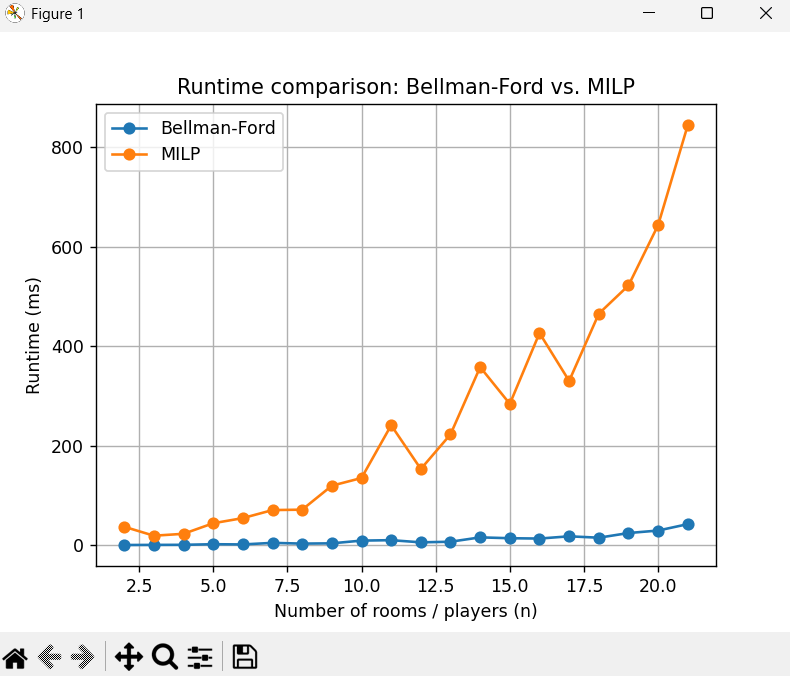

# Envy-Free Room Allocation
### Comparing a **Bellman–Ford-based** subsidy rule to a **MILP / CVXPY** pricing rule

---

## 📁 Repository Layout

```
.
├── algo_EX7.py                  # Bellman–Ford implementation
├── algo_EX7L.py                 # MILP / CVXPY implementation
├── utils.py                     # Shared helpers (assignment, envy graph, etc.)
├── test_fair_rent_room_division.py  # Benchmark & demo runner
└── README.md                    # This file
```

| File         | Description                                                                             |
|--------------|-----------------------------------------------------------------------------------------|
| `algo_EX7.py`  | Build an envy graph and use Bellman–Ford to compute subsidies (O(V*E)).    |
| `algo_EX7L.py` | Formulate a linear program using CVXPY to enforce envy-freeness and balance payments.   |
| `utils.py`     | Shared helpers: `find_assignment`, `build_envy_graph`, `check_envy`, `print_result`, etc. |

---

## 🧪 Tested Inputs

| Case | Valuation Matrix V                    | Description |
|------|----------------------------------------|-------------|
| 1    | `[[150, 0], [140, 10]]`               | One player vastly prefers a single room |
| 2    | `[[100, 100], [100, 100]]`            | Symmetric – everyone values everything equally |
| 3    | `[[90, 100], [80, 120]]`              | Slight preference differences; mild gains |
| 4    | `[[100, 0], [50, 50]]`                | One player indifferent, the other single-minded |
| 5    | `[[1000, 10], [5, 990]]`              | Extremely skewed preferences |
| 6    | `[[100,0,0],[0,100,0],[0,0,100]]`     | Identity matrix – each prefers a unique room |
| 7    | `[[100,200,0],[0,100,200],[200,0,100]]` | Cyclic preferences |

---

## 📊 Side-by-Side Results

### Case 1 (`rent = 100`)
| Player | Bellman-Ford | MILP |
|--------|---------------|------|
| 0      | (0, 125.00)   | (0, 120.00) |
| 1      | (1, -25.00)   | (1, -20.00) |

### Case 2 (`rent = 100`)
| Player | Bellman-Ford | MILP |
|--------|---------------|------|
| 0      | (1, 50.00)    | (1, 50.00) |
| 1      | (0, 50.00)    | (0, 50.00) |

### Case 3 (`rent = 100`)
| Player | Bellman-Ford | MILP |
|--------|---------------|------|
| 0      | (0, 45.00)    | (0, 37.50) |
| 1      | (1, 55.00)    | (1, 62.50) |

### Case 4 (`rent = 100`)
| Player | Bellman-Ford | MILP |
|--------|---------------|------|
| 0      | (0, 100.00)   | (0, 75.00) |
| 1      | (1, 0.00)     | (1, 25.00) |

### Case 5 (`rent = 100`)
| Player | Bellman-Ford | MILP |
|--------|---------------|------|
| 0      | (0, 545.00)   | (0, 51.25) |
| 1      | (1, -445.00)  | (1, 48.75) |

### Case 6 (`rent = 300`)
| Player | Bellman-Ford | MILP |
|--------|---------------|------|
| 0      | (0, 166.67)   | (0, 100.00) |
| 1      | (1, 66.67)    | (1, 100.00) |
| 2      | (2, 66.67)    | (2, 100.00) |

### Case 7 (`rent = 300`)
| Player | Bellman-Ford | MILP |
|--------|---------------|------|
| 0      | (1, 200.00)   | (1, 100.00) |
| 1      | (2, 0.00)     | (2, 100.00) |
| 2      | (0, 100.00)   | (0, 100.00) |

---

## ⏱️ Random Benchmark (Runtime Comparison)



We ran 20 random valuations for each `n = 2..21`:

- **Bellman–Ford** scales quadratically and stays under 50 ms even at `n=21`.
- **MILP** runtime grows quickly past `n=10`, reaching over 800 ms.

**Conclusion:** Bellman–Ford is fast and suitable for real-time use. MILP provides stronger guarantees but is computationally slower.

---

## 🚀 How to Run

```bash
pip install -r requirements.txt       # includes: networkx, cvxpy, pandas, matplotlib
python test_fair_rent_room_division.py
```

---

Happy allocating! 🎉
