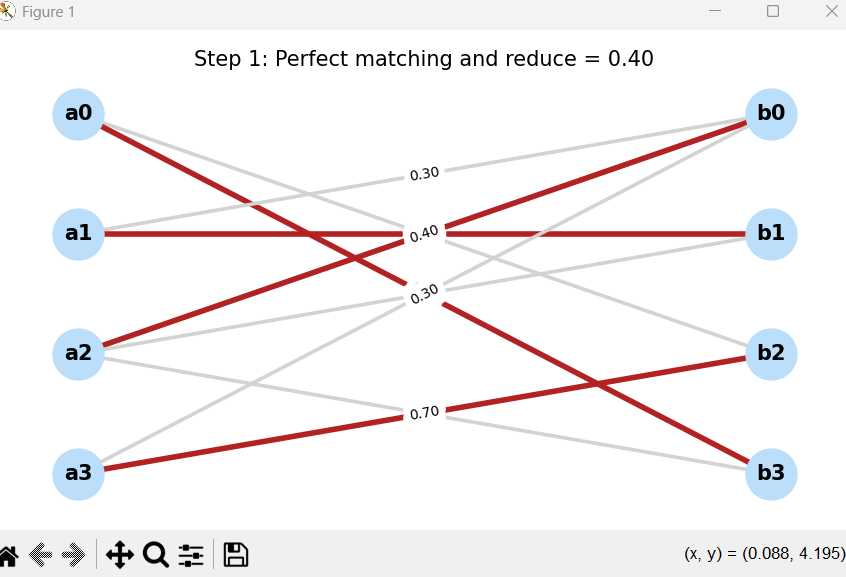
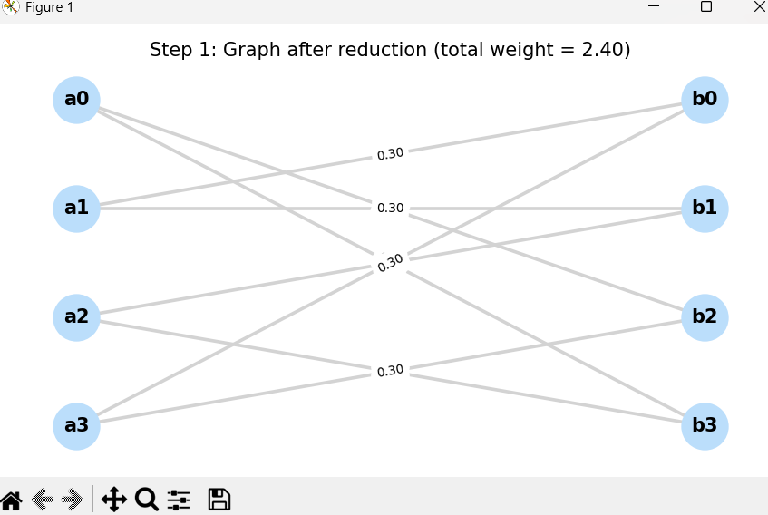
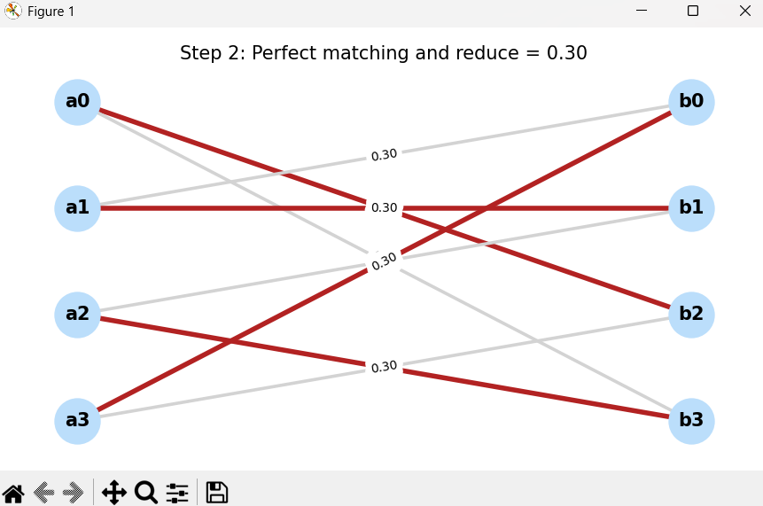
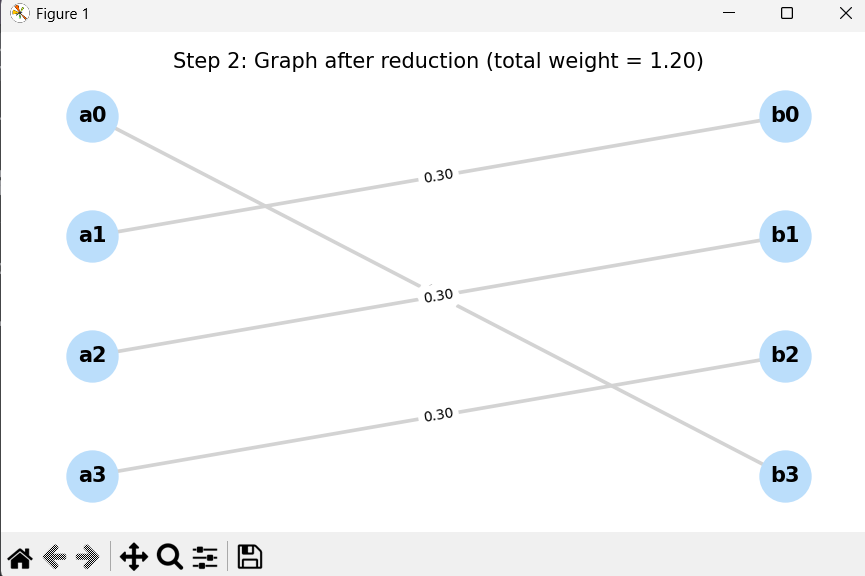
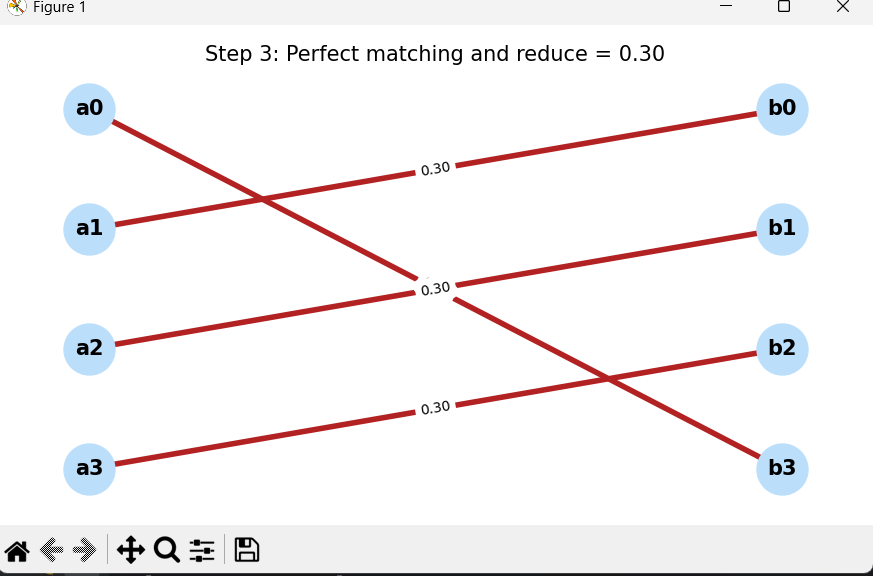
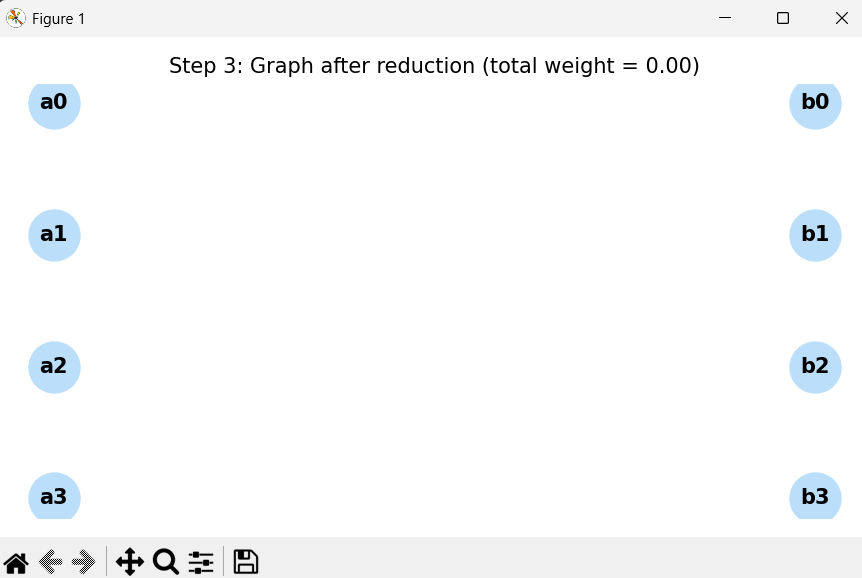

# 🧮 Birkhoff–von Neumann Decomposition with Visualization

## 📘 Overview

This project implements the **Birkhoff–von Neumann decomposition algorithm** with step-by-step visualization using `matplotlib` and `networkx`.

A **doubly stochastic matrix** (i.e., every row and column sums to 1) can be decomposed into a convex combination of **permutation matrices**.  
The algorithm finds a sequence of **perfect matchings** in a bipartite graph representation of the matrix.

Each matching is displayed graphically in a separate window.

---

## 🧠 How the Algorithm Works

1. Construct a weighted bipartite graph from matrix `M`.
2. Find a **perfect matching**.
3. Determine the **minimum weight** in the matching.
4. Subtract it from all matching edges in `M`.
5. Store the matching and its weight as a component in the decomposition.
6. Repeat until the matrix is zeroed out (within floating-point tolerance).

---

## 📊 Test Results

Below are test cases used and the resulting decomposition into matchings and probabilities.

### ✅ Test: `example in class`
**Input Matrix:**
```
[[0.  0.  0.3 0.7]
 [0.3 0.7 0.  0. ]
 [0.4 0.3 0.  0.3]
 [0.3 0.  0.7 0. ]]
```

<p align="center">
  
  
  
  
  
  
</p>


**Decomposition:**
```
• With probability 0.4: a2--b0 , a3--b2 , a1--b1 , a0--b3
• With probability 0.3: a2--b3 , a3--b0 , a1--b1 , a0--b2
• With probability 0.3: a2--b1 , a3--b2 , a1--b0 , a0--b3
```

### ✅ Test: `original`
**Input Matrix:**
```
[[0.  0.5 0.5 0. ]
 [0.4 0.3 0.  0.3]
 [0.2 0.2 0.5 0.1]
 [0.4 0.  0.  0.6]]
```
**Decomposition:**
```
• With probability 0.2: a2--b0 , a3--b3 , a1--b1 , a0--b2
• With probability 0.2: a2--b1 , a3--b0 , a1--b3 , a0--b2
• With probability 0.1: a2--b2 , a3--b0 , a1--b3 , a0--b1
• With probability 0.1: a2--b3 , a3--b0 , a1--b1 , a0--b2
• With probability 0.4: a2--b2 , a3--b3 , a1--b0 , a0--b1
```

### ✅ Test: `Identity`
**Input Matrix:**
```
[[1. 0. 0.]
 [0. 1. 0.]
 [0. 0. 1.]]
```
**Decomposition:**
```
• With probability 1.0: a2--b2 , a1--b1 , a0--b0
```

### ✅ Test: `Uniform 3x3`
**Input Matrix:**
```
[[0.33333333 0.33333333 0.33333333]
 [0.33333333 0.33333333 0.33333333]
 [0.33333333 0.33333333 0.33333333]]
```
**Decomposition:**
```
• With probability 0.3: a2--b0 , a1--b1 , a0--b2
• With probability 0.3: a2--b1 , a1--b2 , a0--b0
• With probability 0.3: a2--b2 , a1--b0 , a0--b1
```

### ✅ Test: `Two matchings`
**Input Matrix:**
```
[[0.5 0.5 0. ]
 [0.  0.5 0.5]
 [0.5 0.  0.5]]
```
**Decomposition:**
```
• With probability 0.5: a2--b2 , a1--b1 , a0--b0
• With probability 0.5: a2--b0 , a1--b2 , a0--b1
```

### ❌ Test: `error`
**Input Matrix:**
```
[[0.2 0.8]
 [0.2 0.2]]
```
**Result:**
```
Step 3: Incomplete matching
Matching edges: [('a0', 'b1')]
Matrix M:
[[0.  0.6]
 [0.  0. ]]
→ RuntimeError: num of matches < n , not a perfect matching
```

---

## 📎 How to Run

```bash
python algo_EX9.py
```

Each step opens a new window showing:
- The current graph with matching edges in red
- The matrix after reduction

---

## 🛠️ Requirements

- Python 3.x
- `numpy`
- `matplotlib`
- `networkx`